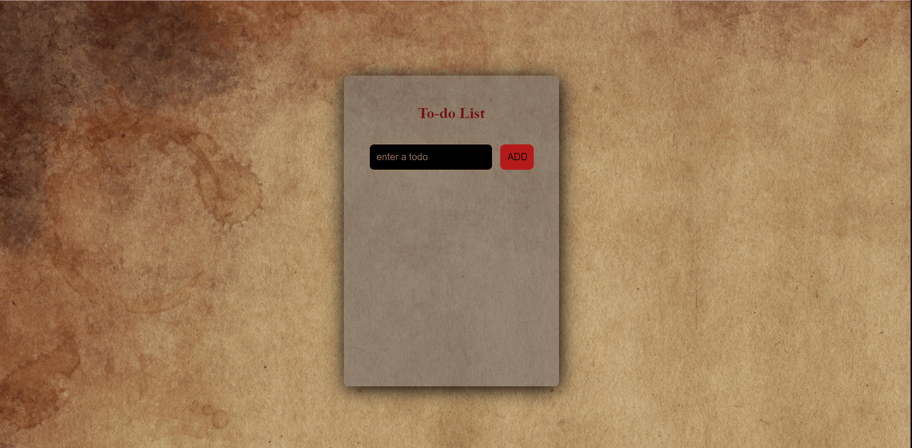

## Description
I have made a todo app with js before. In this project, todo app made with react. 😊🎉

## Project Link
[Live](https://to-do-react-jet-zlh.vercel.app/)

## USAGE 
Todos  
📝 you can add it to your list  
📝 you can delete it from your list  
📝 you can edit  
📝 If it's done, you can cross it off  

## Used technologies
👉 React.js  
👉 React Hooks  
👉 Uuid  
👉 React-icons  
👉 Local-storage  

In the project directory, you can run:

### `npm install` && `npm start`
